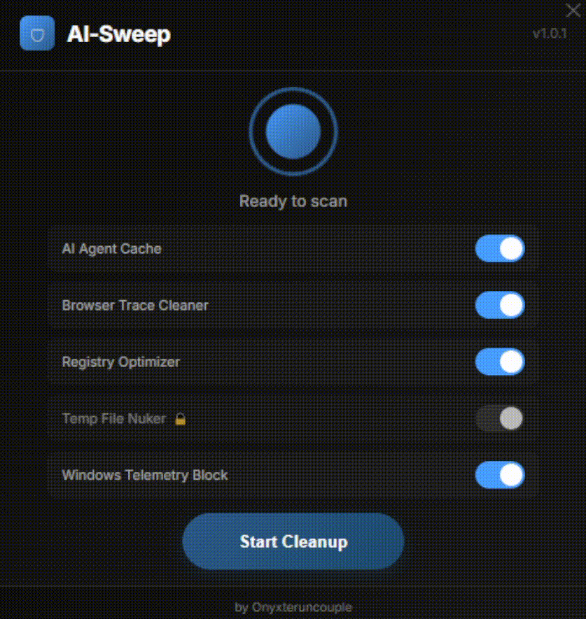

# 🧹 AI-Sweep v1.0.1

**Take back control of your Windows system.**  
A lightweight utility that removes digital traces left by AI agents, system telemetry, and junk files.

  

---

## Why AI-Sweep?

Windows 11 ships with Copilot, Recall, and aggressive telemetry. Local AI tools like Ollama, Claude Code, and LM Studio leave behind gigabytes of cached models and session logs. Your system slows down. Your disk fills up. Your privacy leaks.

**AI-Sweep cleans it all in one click.**

---

## Cleanup Modules

| Module | Description | Status |
|--------|-------------|--------|
| 🧠 **AI Agent Cache** | Clears cache, stale models, session tokens, and interaction logs from local AI agents | Optional |
| 🌐 **Browser Trace Cleaner** | Deletes tracking cookies, cache, and download history (preserves passwords/bookmarks) | Optional |
| 🔧 **Registry Optimizer** | Fixes broken registry keys left by uninstalled AI tools | Optional |
| 🧹 **Temp File Nuker** | Deletes Windows temp files in all system directories | **Always Active** |
| 🛡️ **Windows Telemetry Block** | Blocks known telemetry endpoints for Copilot, Recall, and diagnostics | Optional |

### Why is Temp File Nuker always active?

AI agents and Windows 11 services store their largest digital footprint in temporary folders. Copilot cache, Recall snapshots, and telemetry logs all reside in `%temp%`, Prefetch, and Recent Files. **This module is the foundation of the entire cleanup** — without it, removing other traces is incomplete.

---

## Usage

1. Download all files from the repository
2. Extract the folder to any convenient location
3. Run **AI-Sweep.exe**, it works portably right out of the box
4. Select the modules you want to clean
5. Click **Start Cleanup**

---

## System Requirements

- Windows 10/11 (64-bit)

---

## Developer

**Onyxteruncouple**

---

## License

MIT License
